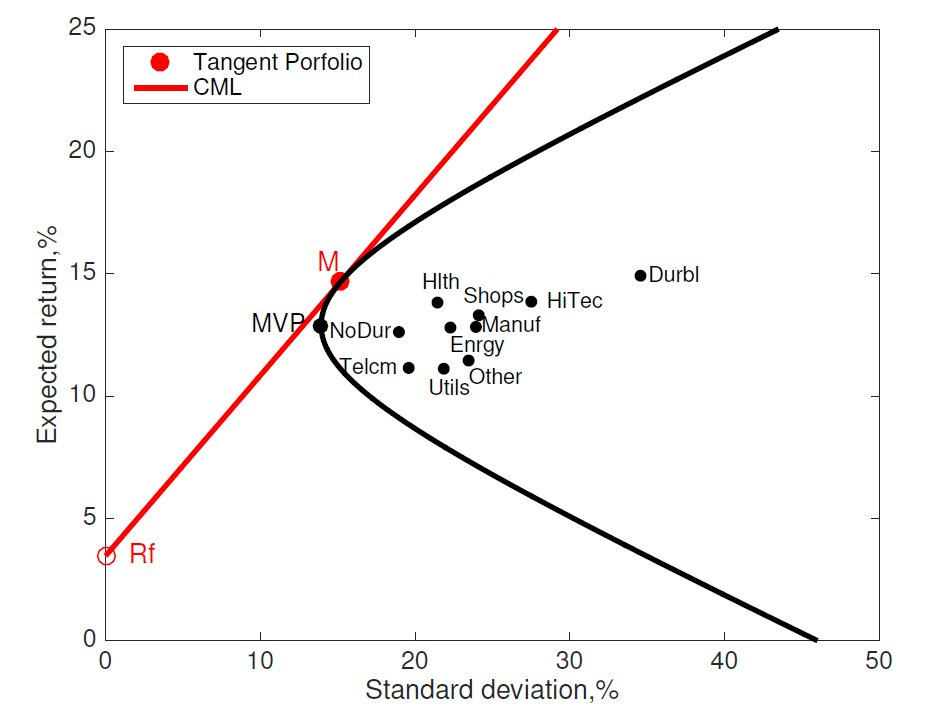
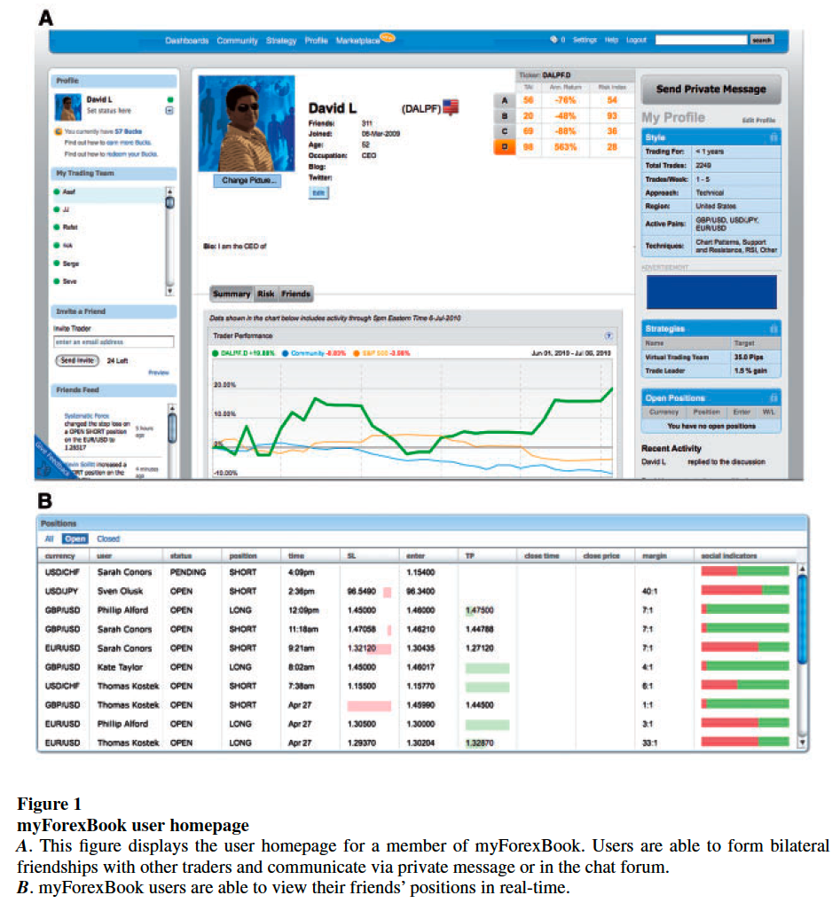
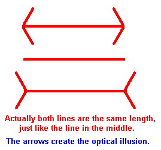

#  **Expected utility theory, it's violations, and it's implications to financial markets.**

MGFD40 Investor Psychology

Charles Martineau
University of Toronto
Winter 2023
___

#  **Neoclassical economics and finance**

When we talk about behavioral finance, we are comparing to theories in
neoclassical economics and finance (that you learn in most other courses). 

It is important to understand the "benchmark" or the "target" of
behavioral finance, that is, neoclassical economics and finance theories to
understand  **where behavioral finance comes from.**

___

# **Assumptions of Rationality**

___

#  **Rationality**

In standard neo-classical economics, researchers usually assume that people are **rational**.

What does it mean to be "rational"?

Rationality has three layers

- People have **rational preference** across possible outcomes or states
of nature; 
- People **maximize their utility** and firms maximize profits under
constraints;
- People make **decisions** based on all relevant information.

___

#  **Rational Preferences**

Definitions and notations: suppose one agent has two choices X and Y,

- **Weak preference (X ≥ Y):**  agent prefers X at least as much as Y;

- **Strict preference: (X > Y):**  agent strictly prefers X than Y; 

- **Indifference: (X ∼ Y):** agent is indifferent in choosing X or Y.

When we compare utilities, they are **ordinal** (order-preserving) instead of
being **cardinal** (expressed by exact numbers) using utilities (U) often
expressed as a function of wealth, e.g, $U(w)=ln(w)$.

___

#  **Rational Preferences**

Two important properties of rational preferences:

**Completeness:** For any one pair of choices, X and Y, a person can
compare all possible choices and assess preference or indifference.

- $X ≥ Y$, or,
- $X ≤ Y$, or both
- $X ≥ Y$ and $X ≤ Y$ (which means, $X ∼ Y$).

**Transitivity:** If $X ≥ Y$ and $Y ≥ Z$, then $X ≥ Z$; if $X>Y$ and $Y>Z$, then $X>Z$.

___

#  **Utility Maximization**

Utility function: $U(w)$

- Describe the satisfaction level received from consuming the endowment $w$;

- $w$ is usually not one good or one service; instead, it is usually a “bundle” of goods, e.g, U(an apple an orange) > U (two apples)

- Utility maximization under constraints:

######  Max $U(w)$ subject to $f(w)=c$ (some constraints)

- E.g., the portfolio optimization problem (see next slide)

___

#  **Utility Maximization**
 Do you remember this?

___

#  **Relevant Information**

Another assumption in neoclassical economics is that people maximize
their utility using full information of the choice set.

In Principle of Finance, we discussed which cash flows are relevant and
how to incorporate all “relevant cash flows” in computing NPVs correctly;

- Of course, the “relevant cash flows” are predicted and estimated
based on relevant information.

Even within the neoclassical framework, researchers recognize that 
- Relevant information is not free (transaction cost);
- Relevant information is not frictionless (effort cost);

___

#  **Expected Utility Theory**

##### Developed by John von Neumann and Oskar Morgenstern

___

#  **Expected Utility**
### Risk vs. Uncertainty/Ambiguity
- *Risk*: measurable random states of outcomes with known probability distribution;
- *Uncertainty/Ambiguity*: random states of outcomes with unknown probability distribution or unknown states;

Expected Utility is set up to deal with risk, not uncertainty.

- $E[U(w)] = \sum_{i=1}^N p_i U(w_i) =$ Expected utility

- $p_i =$ probability of state $i (i =1...N)$

- $U ( w_i )=$ Utility of getting outcome $w_i$ in state $i$

___

#  **Example of Expected Utility Function**

There is a lottery with two possible outcomes:
- **Outcome 1:** Payoff $=100,$ with probability $40\%$
- **Outcome 2:** Payoff= $200,$ with probability $60\%$
- agent has a log utility: $U(w) = ln(w)$

Will this agent prefer this lottery to a payoff of $(200 × 0.6 + 100 × 0.4) = 160$ without any uncertainty?

$E[U(w)] = 0.4 × ln(100) + 0.6 × ln(200) = 5.02 <$ 

$U(E(w)) = ln(200 × 0.6 + 100 × 0.4) = 5.08$

$\rightarrow$ Therefore, the agent will prefer $160 certain payment than this lottery.

___

# **Review: Risk Attitude**

___

# **Risk Attitude**

**Risk Attitude:** whether an agent asks for additional compensation of returns for carrying more risks;

**Certainty equivalent wealth** **(** $CE$ **):** the wealth level that leads agents to be indifferent between the lottery and a certain wealth level: $E[U( w)] = U(CE)$

In the previous example, $U(CE) = E[U (w)]= 5.02$ hence, $CE=151.41$

- Risk Averse: $E[U (w)] < U(E[w]);$ or $CE < E[w]$; or concave utility;

- Risk Seeking: $E[U (w)] > U(E[w]);$ or $CE > E[w]$; or convex utility;

- Risk Neutral: $E[U(w)] = U(E[w]);$ or $CE = E[w]$; or linear utility;

___

#  **Utility Function**

Risk Averse:
- $E[U(w)] < U(E[w])$
- $CE < E[w]$

**RP stands for Risk Premium** $⇒ RP=E(W)-CE.$ When RP is positive, it means that this person dislike risks.She requires an additional payoff to take risk.
___

### Let's revise the previous graph with numbers.

What is the $\textcolor{red}{red\; dot}$?
- Imagine that you draw a straight line between $U(W_0)$ and $U(W_1)$ (starting from the curved line). It is the average using 0.40 and 0.60 as weights.
  
The y-axis value for the $\textcolor{red}{red\; dot}$ and $\textcolor{green}{green\; dot}$ is equal to: 
- $E(U(W))=0.40ln(100)+0.60ln(200)=5.02$

y-axis value for the $\textcolor{blue}{blue\; dot}$ is
-  $U(E(W))=ln(0.40\times100+0.60\times200)=5.08$

x-axis value for the $\textcolor{green}{green\; dot}$ is
-  the inverse of $E(U(W))$, i.e., $exp(5.02)=151.41$

___

#  **Utility Function**

Risk Seeking:
- $E[U(w)] > U(E[w])$
- $CE > E[w]$

What kind utility function is this?
E.g., $*w ^2$ or $w ^{1.5}$

The **risk premium in this case negative**. That persons likes to take risks and is willing to pay to to enjoy the risk.

___

#  **Utility Function**

Risk Neutral:
- $E[U(w)] = U(E[w])$
- $CE = E[w]$

Someone that is indifferent to risk. Only cares about the expected return.

___

## **Violations of Expect Utility Theory and its Implication in Financial Market**
1. Allais paradox
2. Prospect theory
3. Framing
   - Special type of Framing: Mental accounting
___

#  **Violations of Expect Utility Theory and its Implication in Financial Market (1):**

##  **Allais Paradox**

___

#  **Allais paradox**

**Experiment 1:** Which lottery do you prefer?
Lottery A: Get  $1M for sure.
Lottery B: Get $0 with prob. 1%, $1M with prob. 89%, and $5M with prob. 10%.
  

**Experiment 2:** Which lottery do you prefer?
Lottery A: Get $0 with prob. 89%, get $1M with 11% prob.
Lottery B: Get $0 with prob. 90%, get $5M with 10% prob.

___

#  **Allais Paradox**

In the first experiment, most people **choose A,** which means:

$U(1, 000, 000) > 0.89U(1, 000, 000) + 0.1U(5, 000, 000)$ if $U(0) = 0$ 

Organize this expression, we get:

$0.11U (1, 000, 000) > 0.1U(5, 000, 000)$

___

#  **Allais Paradox**

In the second experiment, most people **choose B,** which means: 

$0.11U(1, 000, 000) < 0.1U(5, 000, 000)$ 
  Did you notice the preference sign flipping from > in A to < in B?

**This contradicts the previous results!**

___

#  **Violations of Expect Utility Theory and its Implication in Financial Market (2):**

##  **Prospect Theory**

  **Developed by Daniel Kahneman and Amos Tversky**

___

#  **Prospect Theory**

**Experiment 3:** Choose one lottery that you prefer
A: you get $250 for sure;
B: you get $0 with probability 75%; and you get $1000 with probability 25%.
 
**Experiment 4:** Choose one lottery that you prefer
A*: you lose 750 for sure;
B*: you lose 1000 with probability 75% and you lose nothing with probability 25%

___

#  **Prospect Theory**

**Experiment 3:** Choose one lottery that you prefer
A: you get $250 for sure;
B: you get $0 with probability 75%; and you get $1000 with probability 25%.
  
**Experiment 4:** Choose one lottery that you prefer
A*: you lose $750 for sure;
B*: you lose $1000 with probability 75% and you lose nothing with probability 25%
  

**Observation 1:** People tend to sometimes exhibit risk aversion and sometimes exhibit risk seeking, **dependent on the nature of the prospects.**

___

#  **Prospect Theory**

**Experiment 5.A:** Suppose that you have $300 in your pocket. Choose one lottery that you prefer:
A: you get $100 for sure;
B: you get $0 with probability 50%; and you get $200 with probability 50%;
  

**Experiment 5.B:** Suppose that you have $500 in your pocket. Choose one lottery that you prefer:
A: you lose $100 for sure;
B: you lose nothing with probability 50%; and you lose $200 with probability 50%;

___

#  **Prospect Theory**

**Experiment 5.A:** Suppose that you have $300 in your pocket. Choose one lottery that you prefer:
A: you get $100 for sure;
B: you get $0 with probability 50%; and you get $200 with probability 50%;
  

**Experiment 5.B:** Suppose that you have $500 in your pocket. Choose one lottery that you prefer:
A: you lose $100 for sure;
B: you lose nothing with probability 50%; and you lose $200 with probability 50%;

**Observation 2:** People’s valuation of prospects depend on gains and losses relative to a reference point.

___

#  **Prospect Theory**

**Experiment 6:** What value of x would make you indifferent in choosing between lotteries A and B?

A: you get nothing with probability 100%;
B: you get $x$ with probability 50% and you lose $25 with probability 50%.

___

#  **Prospect Theory**

**Experiment 6:** What value of x would make you indifferent in choosing between lotteries A and B?
A: you get nothing with probability 100%;
B: you get $x$ with probability 50% and you lose $25 with probability 50%.
  

**Observation 3:** People are particularly averse to losses because losses loom larger than gains.

___

#  **Prospect Theory**

**Experiment 7a:** You purchased a stock for $50 and it is now selling at $40. You have a paper loss of $10 per share. In the next period, it is equally likely that it will increase or decrease by $10. Would you:
- Sell the stock and realize a $10 loss?

OR

- Hold on for a $50/50$ shot at another loss or breaking even?

___

#  **Prospect Theory**

**Experiment 7b:** You purchased a stock for $50 and it is now selling at $60. You have a paper gain of $10 per share. In the next period, it is equally likely that it will increase or decrease by $10. Would you:

- Sell the stock and realize a $10 gain?

OR

- Hold on for a $50/50$ shot at another gain or breaking even?
  

___

#  **Prospect Theory**

**Experiment 7b:** You purchased a stock for $50 and it is now selling at $60. You have a paper gain of $10 per share. In the next period, it is equally likely that it will increase or decrease by $10. Would you:

- Sell the stock and realize a $10 gain?

OR

- Hold on for a $50/50$ shot at another gain or breaking even?
  

**Observation 4:** Losers become more willing to take on risk in an attempt to break even. This finding is thank to Richard Thaler.

___

#  **Prospect Theory**

People give a much higher weight on probability changes in extremes (e.g., close to 0% or 100%) relative to probability changes in normal ranges;

**Example 1:** A patient is willing to pay much more if a medication can change the probability of full recovery from no chance to 1% vs. from 50% to 51%.

**Example 2:** In Canada, the probability of winning a big lottery is 1 in 13,983,816; you are more likely to:

- Be killed in a terrorist attack while travelling (1 in 650,000).
- Be killed by lightning (1 in 56,439).

___

#  **Prospect Theory**

People give a much higher weight on probability changes in extremes (e.g., close to 0% or 100%) relative to probability changes in normal ranges;

**Example 1:** A patient is willing to pay much more if a medication can change the probability of full recovery from no chance to 1% vs. from 50% to 51%.

**Example 2:** In Canada, the probability of winning a big lottery is 1 in 13,983,816; you are more likely to:

- Be killed in a terrorist attack while travelling (1 in 650,000).
- Be killed by lightning (1 in 56,439).

**Observation 5:** People **overweight extreme probabilities and underweight normal probabilities.**

___

#  **Prospect Theory - Value Functions and Their Weights**

Kahneman and Tversky (1979): Prospect utility is developed to reconcile the violations of expected utility theory.

Value function: prospect utility function

######  $U( x )= \sum_{i=1}^N w (p_i ) v ( x_i )$

where x is a state-dependent payoff.

$w(.)$ is the weight function so that
- assign higher weight on low-probability event when the payoff is negative;
- assign higher weight on certainty when the payoff is positive;
- assign higher weight when the probabilities are close to extremes.

$v(.)$ is the value function, it is convex when $x<0$ and concave when $x>0$.

___

#  **Prospect Theory**
#### Value functions and their weights

___

#  **Prospect Theory in Sports**

Prospect theory says that losses hurt more than gains. Let’s apply this thinking to sport coaches ...

- In hockey, if down by one goal, coaches usually pull out the goalie for an extra attacker with 1 or 2 minutes left.
- [Research shows](https://papers.ssrn.com/sol3/papers.cfm?abstract_id=3132563) that it is optimal based on the probabilities for a coach to pull the goalie when there is 6 minutes left in the game.
- Doing so, it would increase the expected number of points at the end of the season by 3 points. Might sound small, but enough for many teams to make the playoffs.
- Why are coaches not more tempted to pull goalies earlier in the game?

___

#  **Prospect Theory in Sports**

- Say that you are down 0-1, and you pull the goalie with 6 min left and lose 0-5, does the coach looks stupid? Yes, to many that don’t understand probabilities. A coach prefers to lose 0-1 or 0-2 than 0-5. The coach looks more credible, more likely to keep is job.
- If a coach plays the probabilities, he might look wild, increase the likelihood to get fired, even though he makes the right choice.
- Hence, the psychological reflexion in the mind of the coach is that being scored by pulling the goalie to early hurts more (loss) than actually scoring and tie the game (gain).
- The same can be said for 4$^{th}$ down play in football.

___

##  **Implications of Prospect Theory to Financial Market**
1. The disposition effect
   - Odean (1998) 
   - Frazzini (2006)
   - Heimer (2016)

___

#  **Disposition Effect**

The disposition effect is the tendency of individual investors to sell assets whose price has increased and keep assets that have dropped in value;
- A direct implication of the prospect theory.
- This is puzzling. Stocks that have recently done well continue to outperform, on average, while those that have done poorly continue to underperform. As such, investors should concentrate their selling among stocks with poor past performance-but they do the opposite.
___

#  **Disposition Effect**

**Why is this related to prospect theory?**

The intuition is that, if a stock performs poorly (great), this brings its owner in to the loss (gain) stock region of the value function, where, because of the convexity (concavity), the owner becomes risk-seeking (risk-averse). As a result, investor holds on to (sells) the stock in the hope of breaking even later on.
___

# **Are Investors Reluctant to Realize Their Losses? (Odean, 1998)**

Terry Odean examines the disposition effect, the tendency of investors to hold losing investments too long and sell winning investments too soon, by analyzing trading records for 10,000 accounts at a large discount brokerage house.

---
### Definitions:
- Realized gain (losses) is your return after selling the asset.
- Paper gain (losses) is your return that is not yet realized, i.e., you haven’t sold the asset yet.

### Findings:

- Investors hold winning stocks for 102 days and losing stocks for 124 days..
- Why look at December separately?
___

# Bonus: Recent [interview](https://www.youtube.com/watch?v=Y2ECnsx1cvs) with Terry Odean
Terry explains his reseach since 1998. 
___

# **Disposition Effect**

The "disposition effect" is the tendency to sell assets that have gained value (‘winners’) and keep assets that have lost value (‘losers’). 

Bonus: [Original study](https://onlinelibrary.wiley.com/doi/abs/10.1111/j.1540-6261.1985.tb05002.x) that coined the term "dispositon effect"

___

# **The Disposition Effect and Underreaction to News**

If you recall from the first class, I showed you a plot of price underreaction to earnings announcements. In the paper titled [“The Disposition Effect and Underreaction to News”](https://onlinelibrary.wiley.com/doi/full/10.1111/j.1540-6261.2006.00896.x?casa_token=WPM4cfaZRC4AAAAA%3A8DhfgxdlUNHpwriRoSAZRk2ENbRmqBUjVuAz9Cw7MVwcbbrn4kf3fFy5sR5Bkpvd3yajEpWUjPRF), Frazzini (2006) proposes that the disposition effect can explain (in part) such finding.

- Frazzini has a “reference price”, which is the aggregate price at which mutual funds paid for a particular stock on each month and examines whether prices underreact more to news (earnings announcements) if the stock price is in **capital gain or losses**.
- Let's examine the theoretical arguments of Frazzini followed by its empirical exercise.

---

**Theoretical findings**

Prefer not to “not sell” because .5U(50) + .5U(30) > U(40) since U is a convex function.

---
**Theoretical findings**

Prefer to “sell” because .5U(50) + .5U(70) < U(60) since U is a concave function.

---

**Implications to bad earnings news**

Why a slow price drift for capital loss? Because following a negative news, people are **not selling**, limiting the the speed at which the price reaches its new equilibrium value.

---

**Implications to good earnings news**

Why slow price drift for capital gain? Because following a positive news, people **are selling**, selling puts a downward pressure on the price limiting the speed at which the price reaches its new equilibrium value.

---

# Main empirical findings of Frazzini (2006)
Frazzini confirms his hypothesis empirically. He first calculates capital gains (losses) overhang as the percentage deviation of the aggregate cost basis from the current price:

$g_t = \frac{p_t − rp_t} {p_t}$

where $p_t$ is the current price and $rp_t$ is the reference price of the aggregate investor calculated from mutual fund holdings. Think about it as the “mental” gain (or loss).

He then examines on each month, based on the previous earnings announcement news (at $t-1$, $t-2$ or $t-3$), if the monthly price on month $t$, month $t + 1$, and so on show price drifts consistent with the figures on the previous slides and he does.

---

# The role of social pressure to disposition effect

It is known that traders value the option to recount victories and “seek to report positively about themselves, as constrained by the need to ... satisfy presentational norms” [(Han and Hirshleifer 2013)](https://www.cambridge.org/core/journals/journal-of-financial-and-quantitative-analysis/article/abs/social-transmission-bias-and-investor-behavior/72313DD8E8227F179EE1ED760B10FD65).

Likewise, losing positions are subject to scrutiny from peers: “...The traders who get wiped out hope against hope...They refuse to take losses... When you’re breaking in a new trader, the hardest thing to learn is to admit that you’re wrong. It’s a hard pill to swallow. You have to be man enough to admit to your peers that you’re wrong and get out. Then you’re alive and playing the game the next day."[(Shefrin and Statman (1985))](https://onlinelibrary.wiley.com/doi/abs/10.1111/j.1540-6261.1985.tb05002.x)
___
# The role of social pressure to disposition effect

[Heimer (2016)](https://academic.oup.com/rfs/article-abstract/29/11/3177/2583763) examine traders behavior in the foreign market before and after the introduction of *myForexBook*, an investment-specific online social network, where traders can exchange message and present their performance. What do you think happens?

___
# The role of social pressure to disposition effect

___

# **Violations of Expect Utility Theory and its Implication in Financial Market (3): Framing**  

---

# **Framing - Experiment**

**(Group Left) Experiment 1:** Imagine that Canada is preparing for an unusual disease, which is expected to kill 600 people. Two alternative plans, A and B, are proposed to combat the disease. The consequences of two plans are provided as follows:

* Plan A: 200 people will be saved for sure;
* Plan B: there are 1/3 probability that all 600 people will be saved and 2/3 probability that none will be saved;

If you are the Prime Minister, which one will you choose?

---

# **Framing - Experiment**

**(Group Right) Experiment 2:** Imagine that Canada is preparing for an unusual disease, which is expected to kill 600 people. Two alternative plans, A and B, are proposed to combat the disease. The consequences of
two plans are provided as follows:

* Plan A*: 400 people will die for sure;
* Plan B*: there are 1/3 probability that nobody will die and 2/3 probability that all 600 people will die.

If you are the Prime Minister, which one will you choose?

---

# **Framing - Experiment**

Take a careful look at Experiment 8 and Experiment 9, what do you see?

* They are essentially the same!
* Then why we have so different choices?

A decision frame is defined to be a decision maker’s view or perception of the problem and possible outcome.

In Experiments 8 and 9 we show that the decisions can be affected by different framing of a same question.

* Therefore, the way we present information matters!
* It is a clear violation of expected utility theory, which states that same probability distribution and same state-dependent outcomes lead to the same level of utility.

---

# **Framing**

Tversky and Kahneman refer to framing as choices made by agents that depend on the way a problem is posed as much as on the objective features of a problem.

* With a traditional economic theory framework, framing cannot alter behavior!

---

# **Framing**
##  How to manipulate your audience

In general, the way we frame a problem or a question can illicit the behavior we want from someone (i.e., manipulation).

For instance, regarding COVID, Trump framed the issue as “save the economy or lock everything down” - as if it was a binary decision. A good strategy to fire up its base!

Binary framing is often suboptimal. It masks the possibility of other alternatives, or pursuing one decision in some places or situations and a different one in others.

---

#  **Framing - COVID**

The way we present / frame data, can also illicit various beliefs/emotions. In this pandemic, the media often presented a graph similar to this:

Can you think of an issue about this data the way it is presented?

---

# **Framing - COVID**

Now that’s a better way to present / frame the data to show the real impact of COVID:

---

# **A Special Type of Framing: Mental Accounting**

Mental Accounting is a set of cognitive operations used by individuals to organize, evaluate and keep track of financial activities.

* I.e., Different items are categorized and “recorded” in different accounts.
* Concept develop by Richard Thaler (1985) - see [original study](https://pubsonline.informs.org/doi/abs/10.1287/mksc.4.3.199) in Marketing Science and for a general overview the following [study](https://onlinelibrary.wiley.com/doi/abs/10.1002/(SICI)1099-0771(199909)12:3%3C183::AID-BDM318%3E3.0.CO;2-F?casa_token=m2pabKBNAIEAAAAA:UHcyCd9vKuIJ9LfooEi7NbGOgJ894PlFFr7XtiCdstJwMaNVEyLjbpl5dIpOoSCu0RUdv6GBNuBR). 

---

# **Mental Accounting: Different scenarios (Thaler, 1985)**

1.  Mr. and Mrs. L and Mr. and Mrs. H went on a fishing trip in the northwest and caught some  salmon. They packed the fish and sent it home on an airline, but the fish were lost in transit. They  received $300 from the airline. The couples take the money, go out to dinner and spend $225. They  had never spent that much at a restaurant before.

2. Mr. X is up $50 in a monthly poker game. He has a queen high flush and calls a $10 bet. Mr. Y owns $100 shares of IBM which went up to  50%  today and is even in the poker game. He has a king high flush but he folds. When X wins, Y thinks to himself, “If I had been up $50  I would have called too.”

---
# **Mental Accounting: Different scenarios (Thaler, 1985)**

3. Mr. and Mrs. J have saved $15,000 toward their dream vacation home. They hope to buy the home in five years. The money earns 10% in a money market account. They just bought a  new car for $11,000 which they financed with a three-year car loan at 15%.

4. Mr. S admires a $125 cashmere sweater at the department store. He declines to buy it, feeling  that it is too extravagant. Later that month he receives the same sweater from his wife for a  birthday present. He is very happy. Mr. and Mrs. S have only joint bank accounts.

---
# **Mental Accounting: Different scenarios (Thaler, 1985)**

All the examples on the previous slide is a clear violation of expected utility theory since whether items are in the same account or different accounts should be irrelevant in expected utility theory.

* In (1), it violates the principle of **fungibility**. Money is not supposed to have labels attached to it. Yet, they treat the $300 into a “windfall” and “food” account. If, instead, they get a $300 increase in their monthly salary, do you think they would have gone to that expensive restaurant?

---

# **Mental Accounting: Different scenarios (Thaler, 1985)**

All the examples on the previous slides is a clear violation of expected utility theory since whether items are in the same account or different accounts should be irrelevant in expected utility theory.

* In (1), it violates the principle of **fungibility**. Money is not supposed to have labels attached to it. Yet, they treat the $300 into a “windfall” and “food” account. If, instead, they get a $300 increase in their monthly salary, do you think they would have gone to that expensive restaurant?

* In (2), it also violates the principle of **fungibility** (there shouldn't be a distinction between your poker and investment money account).
  
---

# **Mental Accounting: Different scenarios (Thaler, 1985)**

All the examples on the previous slide is a clear violation of expected utility theory since whether items are in the same account or different accounts should be irrelevant in expected utility theory.

* In (1), it violates the principle of fungibility. Money is not supposed to have labels attached to it. Yet, they treat the $300 into a “windfall” and “food” account. If, instead, they get a $300 increase in their monthly salary, do you think they would have gone to that expensive restaurant?

* In (2), accounts may be both topically (current interest) and temporally specific.

* In (3), again violates the concept of fungibility (at a costs!) just for self-control.

---

# **Mental Accounting: Different scenarios (Thaler, 1985)**

All the examples on the previous slide is a clear violation of expected utility theory since whether items are in the same account or different accounts should be irrelevant in expected utility theory.

* In (1), it violates the principle of fungibility. Money is not supposed to have labels attached to it. Yet, they treat the $300 into a “windfall” and “food” account. If, instead, they get a $300 increase in their monthly salary, do you think they would have gone to that expensive restaurant?

* In (2), accounts may be both topically (current interest) and temporally specific.

* In (3), again violates the concept of fungibility (at a costs!) just for self-control.

* In (4) illustrate the curious fact that people tend to give as gifts items that the recipients would not buy for themselves, and that the recipients approve the strategy.

---
# **Personal Finance and Mental Accounting**

Understanding mental accounting can make you more savvy with your own personal finances. For example:

* We tend to more likely follow a strict budget allocation with expected cash flow (e.g., paychecks) and “burn” unexpected cash flow (bonuses, tax refunds). Mental accounting says that we treat these two streams of cash flows in two different mental accounts. Be aware of this such that you don’t “burn” your unexpected cash flows.

It is important to keep track of your finances and write everything down.

---

# **Mental Accounting and Disposition Effect**

*A side note:*
Mental accounting provides a foundation for the way in which decision makers set reference points for the accounts that determine gains and losses leading to the dispostion effect. See [Grinblatt and Han (2005)](https://www.sciencedirect.com/science/article/abs/pii/S0304405X05000747?casa_token=Du27E_7YAy8AAAAA:vUJur-HNfUuy7xTaS2h_j0xn_pJr_Lq08_F0xC3xgrhj9JXq8NRFbD-jRIjsL0gg2uMuNlyh5g).

---

# **Summary**

We review the neoclassical utility functions and the notions of risk attitude;

We review the expected utility theory;

We discuss the Allias Paradox and show the following violations of expected utility theory

* Prospect utility
* Framing and mental accounting