### News & Social Media Databases

:::: {.columns}

::: {.column width="50%"}
**News**

- **TDM Studio** — Newspaper/media archives (ProQuest). Available to all students.
- **Bloomberg News Terminal** — Real-time and historical news articles. Available through FinHub.
- **RavenPack** — Structured sentiment scores from news wires and press releases. Available through WRDS.
:::

::: {.column width="50%"}
**Social Media**

- **Reddit / Subreddits** — Retail investor discussions (e.g., r/wallstreetbets)
- **Seeking Alpha** — Crowdsourced analyst articles and comments
- **StockTwits** — Stock-specific microblogging platform
- **Twitter Sentiment** — Aggregated tweet sentiment via Bloomberg
:::

::::

There also macroeconomic news... 

---

### Attention vs. Sentiment: Asset Pricing Implications

:::: {.columns}

::: {.column width="50%"}
**Investor Attention** (news coverage)

- Proxied by number of news articles, abnormal search volume (Google), Bloomberg attention, or media mentions
- Attention affects *when* prices incorporate information — limits to arbitrage, slow diffusion
- Key predictions: post-announcement drift, return predictability from neglect
- Relevant papers: Merton (1987), Barber & Odean (2008), Fang & Peress (2009)
:::

::: {.column width="50%"}
**Investor Sentiment** (tone/opinion)

- Proxied by positive/negative language in articles or social media posts
- Sentiment affects *which direction* prices move — captures noise trader demand or belief disagreement
- Key predictions: return reversals, mispricing, higher volatility around sentiment spikes
- Relevant papers: Baker & Wurgler (2006), Tetlock (2007), Garcia (2013)
:::

::::

Both coexist: a news event increases attention *and* carries a sentiment signal.

---

### Attention as a Proxy for Concern and Uncertainty

News coverage also proxies for **investor concern** and **economic uncertainty** — not just information arrival.

**Theories of endogenous attention** explain why investors rationally choose to pay a cost or exert effort to learn about fundamentals:

- Bansal and Shaliastovich (2011): attention increases with macroeconomic uncertainty
- Kacperczyk, Van Nieuwerburgh, and Veldkamp (2016): attention increases with (a) economic uncertainty and (b) risk aversion / the price of risk

**Implications for asset pricing:**

- Higher attention $\Rightarrow$ more information acquisition $\Rightarrow$ faster price discovery
- But attention is *endogenous*: uncertainty drives attention, which in turn affects prices
- News coverage thus captures both the signal (information) and the demand for that signal (concern)

-> This has implications for the interpretation of announcement risk premia... let's review the evidence on announcement premia first.

---

### Announcement risk premium

```{=tex}
\begin{equation*}
Ret_{t\rightarrow T} = \alpha+\beta News_t + \varepsilon_t
\end{equation*}
```

In event studies, we focus on the $\beta$ coefficient. 

In the announcement premium literature, we look at the $\alpha$. Premium type:

- Macro announcement premium
- Earnings announcement premium

---

### Macro announcement premium

Macro announcement premium refers to the fact that a large fraction of the equity
market risk premium is realized on few trading days with significant macroeconomic
announcements. 

- Announcements: FOMC, CPI, PPI, GDP, Unemp.

- 1961-2023:  44 days/yr with macro announcements ~71% of the aggregate equity market risk compensation.


---

### Why is the macro premium puzzling?

Presents a challenge to standard asset pricing models. 

- Breeden (1979) consumption AP model: 
  - Risk evolves slowly as Brownian motions, and as a result, the risk premium investors receive on the market portfolio will be proportional to the holding period of the asset. 

- The data on the macro announcement premium: 
  - Risk premium on most trading days is very small and even negligible. 
  - Most of the risk premium is realized on a small number of trading days where uncertainty about the macroeconomy is resolved.

---

### Models:

See [Ai and Bansal (2018)](https://onlinelibrary.wiley.com/doi/abs/10.3982/ECTA14607?casa_token=-_Nb1J93qk4AAAAA:SXIO8MhWlDQKkw7q072L6atNqBiz9wvKIhJ2VxF6oj5dMRL1TMg98WbePal-gLtAjyhhX8odxetLjlM6)

- However, hard to read.

See instead:

- [Ai, Bansal, Guo (2023)](https://www.nber.org/system/files/working_papers/w31923/w31923.pdf) for a review.
- [Ai, Bansal, Guo (2022)](https://www.nber.org/papers/w31087) for an application on identifying preference for early resolution.

---

### Announcement premium stats

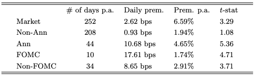{.absolute width="1000"}


---

### Savor and Wilson (2013)

Savor and Wilson (2013) examines the announcement premium for Announcements: 

- PPI/CPI (whichever comes first in the month), 
- FOMC, and 
- Employment from 1958-2009.

---

### Savor and Wilson (2013)

```{=tex}
\begin{equation*}
ExRet_{t} = \alpha+\beta Ann_t + Day F.E. + \varepsilon_t
\end{equation*}
```

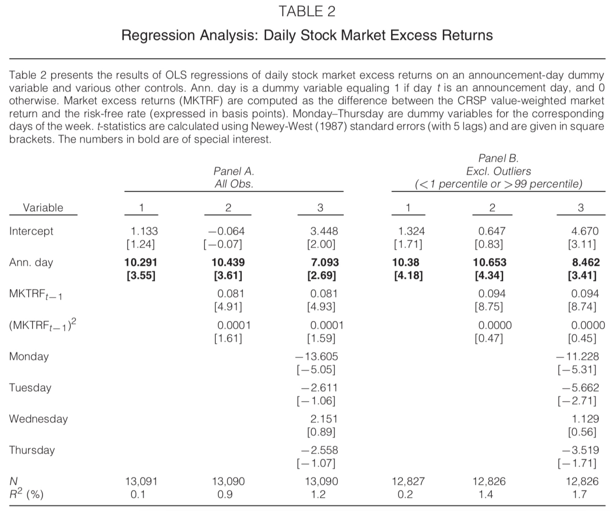{fig-align="center"}

---

### Savor and Wilson (2013)


```{=tex}
\begin{equation*}
\Delta VIX_{t} = \alpha+\beta Ann_t + Day F.E. + \varepsilon_t
\end{equation*}
```

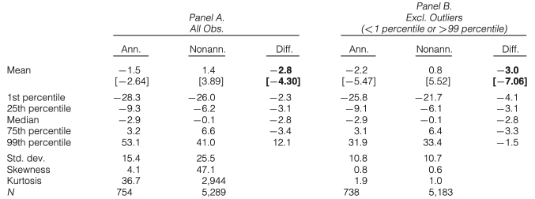{fig-align="center"}


---


### Lucca and Moench (2015)

Pre-FOMC announcement drift

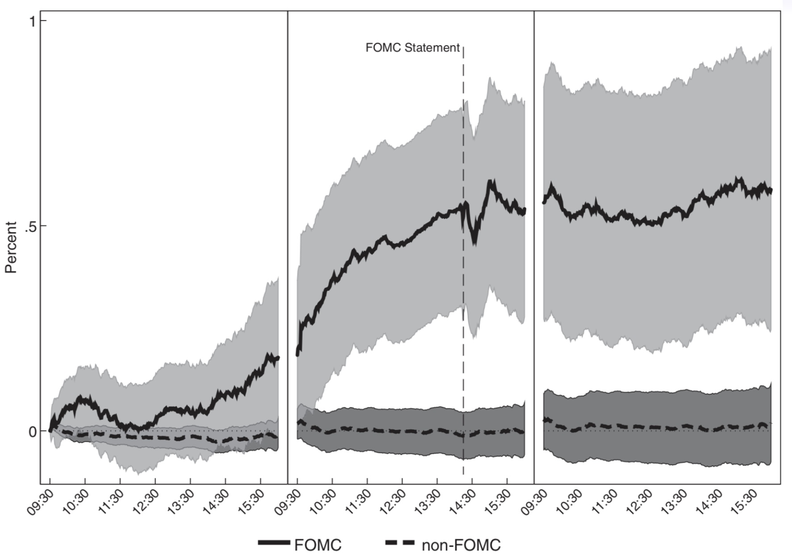{.absolute width="800"}


---

### Lucca and Moench (2015)

This pre-announcement drift is an unresolved puzzle: 

- There is a disconnect between the time when the returns are earned and when the news is revealed.
- Investors may sell out of their positions ahead of the announcement. 
- A larger share of the market risk would be borne by the specialists and would require a higher rate of return.


---

### Also a disconnect with realized volatility

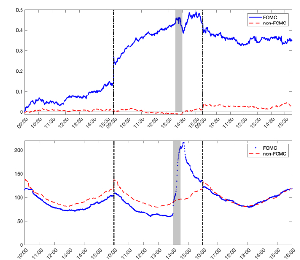{fig-align="center"}

---

### FOMC Press conferences

[Boguth et al. (2019)](https://www.cambridge.org/core/journals/journal-of-financial-and-quantitative-analysis/article/abs/shaping-expectations-and-coordinating-attention-the-unintended-consequences-of-fomc-press-conferences/16DDD90630BA52EB81CCD88171998513)

Evidence that indeed risk and expectation drives announcement date returns.

- 2011-2018: FOMC held press conferences after FOMC meetings (4/8 annual meetings). PC were known in advance. PC were introduced to make the Fed more transparent.

- Find that investors anticipate higher likelihood of changes in interest rates, greater surprises on announcement dates, and command more attention from investors for FOMC with PC.
  
- PC meetings are perceived by investors more important. Consequently, premium should be high on FOMC with PC.

---

### FOMC Press conferences

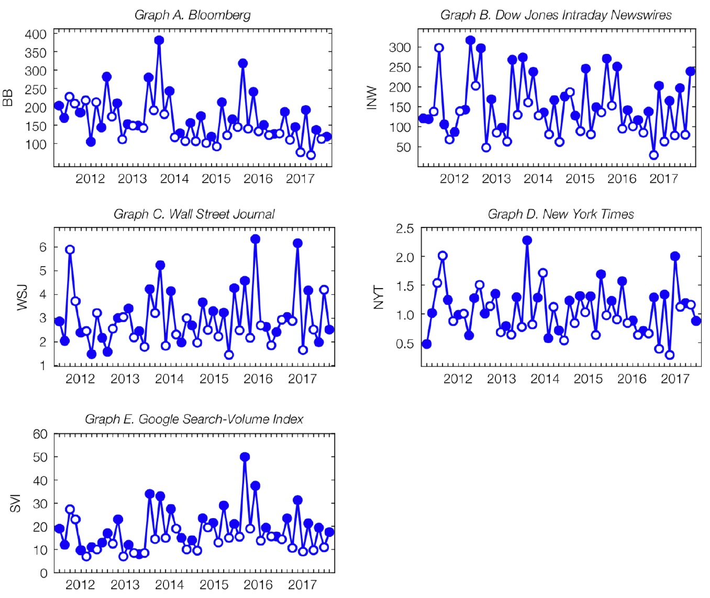{fig-align="center"}

---

### FOMC Press conferences (Boguth et al., 2019)

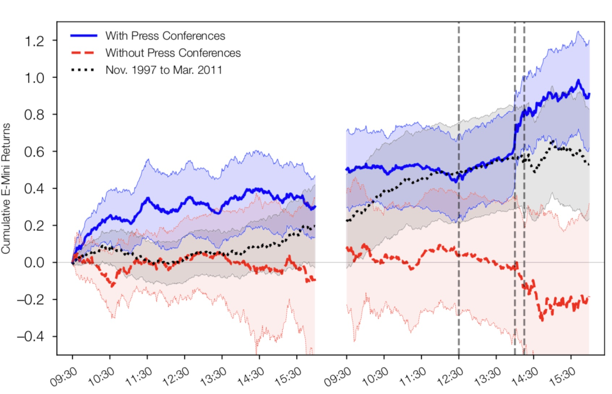{fig-align="center"}

---

### Hu, Pan, Wang, and Zhu (2022)

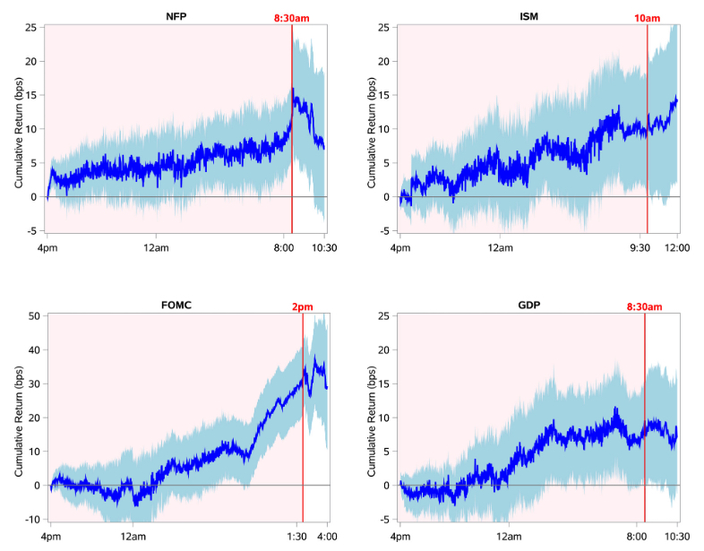{fig-align="center"}


---

### Hu, Pan, Wang, and Zhu (2022)

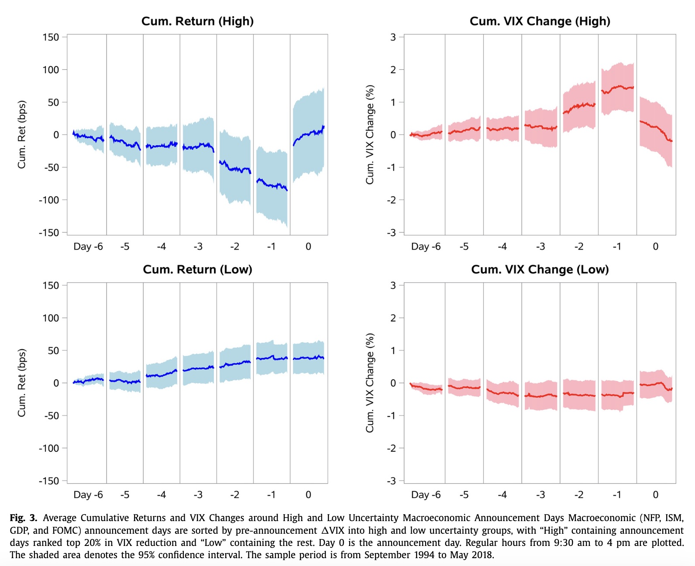{fig-align="center"}

---

### Leakage...?

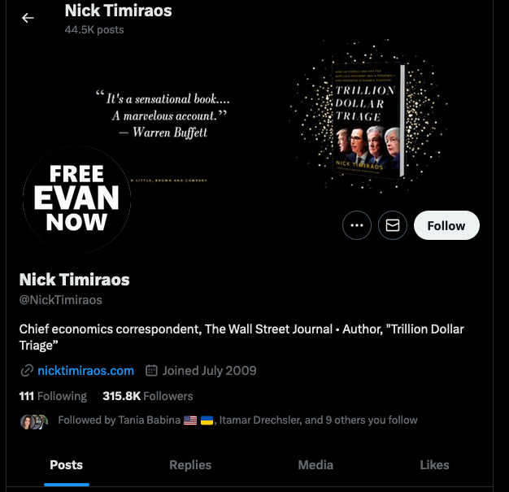{fig-align="center"}


---

### What about other central banks announcements?

- One central bank to rule them all [(Brusa et al., 2020)](https://academic.oup.com/rof/article/24/2/263/5540330)

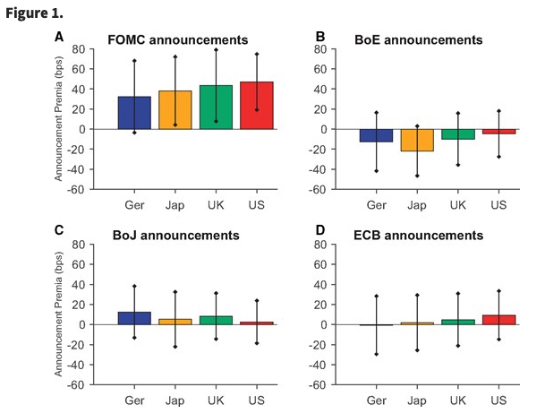{fig-align="center"}


---

### Macro announcement premium and attention

[Fisher et al. (2022)](https://academic.oup.com/rfs/advance-article/doi/10.1093/rfs/hhac011/6535733)

Can investor attention prior to unemployment and FOMC announcements predict the risk premium?

- We argue that attention prior to meetings proxy for investor risk aversion.
  - Bansal and Shaliastovich (2011) and Kacperczyk, Van Nieuwerburgh, and Veldkamp (2016) show that attention increases with economic uncertainty and risk aversion.
  
- We measure attention using articles published in WSJ and NYT.
  - We used Factiva but now we can use TDM Studio. 

---

### Macro announcement premium and attention

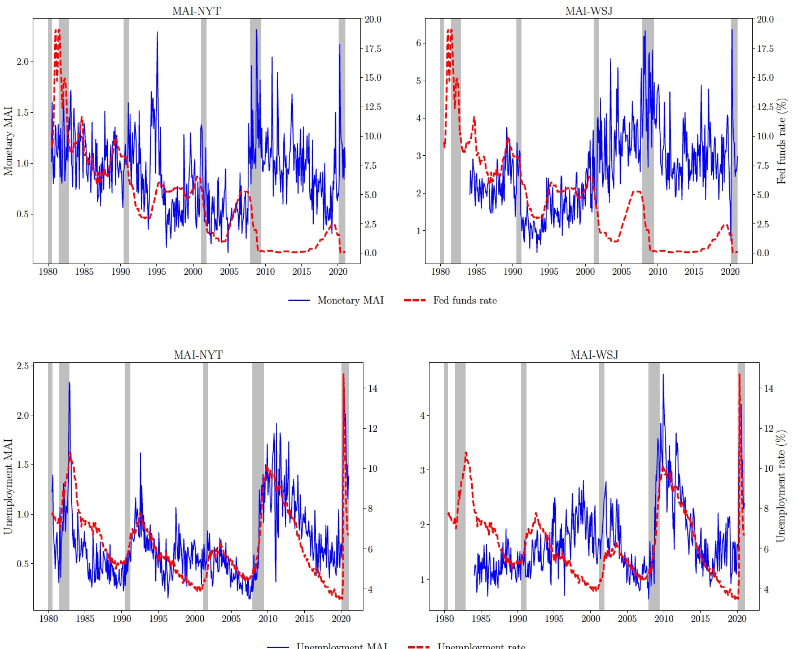{fig-align="center"}

---

### Macro announcement premium and attention

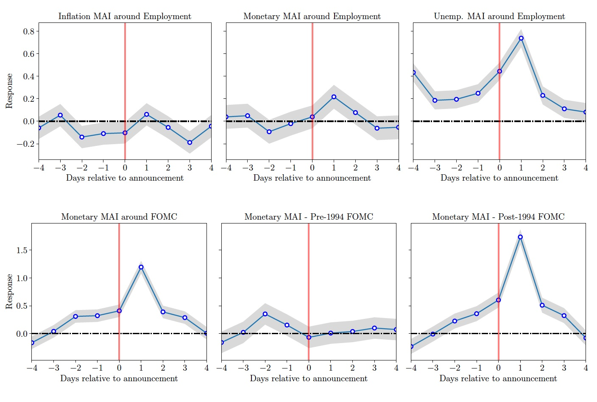{fig-align="center"}

---


### Earnings premium

- Stock prices on average rise in the days around earnings announcements.
- This earnings announcement premium has been known at least since Beaver (1968) and has since
been studied by Chari et al (1988), Ball and Kothari (1991), and Cohen et al (2005).
- See also [Lamont and Frazzini (2007)](https://www.nber.org/papers/w13090).

---

### Earnings premium (Lamont and Frazzini, 2007)

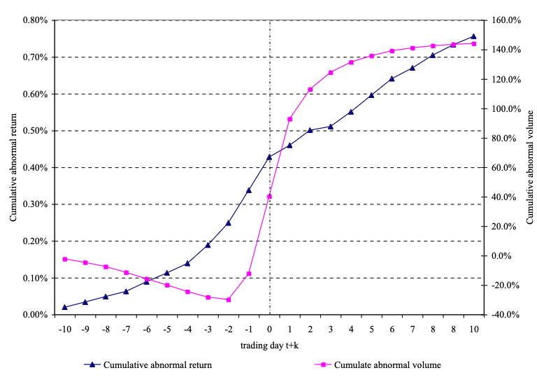{fig-align="center"}


---

### The earnings announcement premium around the globe:  [Barber et al. (2013)](https://www.sciencedirect.com/science/article/pii/S0304405X12002188?casa_token=mAVPH6LE3W8AAAAA:hOGl5dkR1nLeS3jQ1_5IKHO9TX-G2eofOrS8-WpgtBtm7tcKQlwhyYyqDUb8JG4UvxMmxbywMVk1#bib15)

Long-short strategy based on "expected" earnings announcement dates.

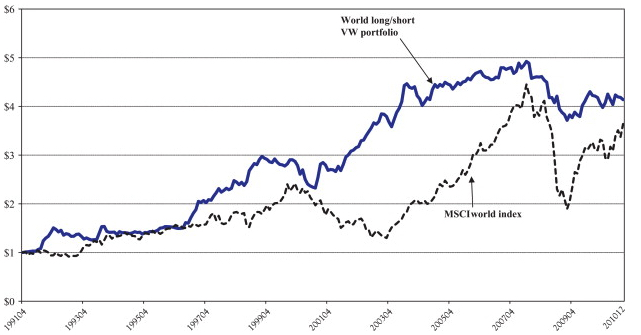{fig-align="center"}

Argue that firm-specific uncertainty is a key driver of the earnings announcement premium.

---

### Earnings premium and uncertainty

[Barth and So (2014)](https://publications.aaahq.org/accounting-review/article-abstract/89/5/1579/3663/Non-Diversifiable-Volatility-Risk-and-Risk)

- They show that investors anticipate some earnings announcements to convey news that increases market return volatility and pay a premium to hedge this non-diversifiable risk. 
- This is motivated from the findings of [Patton and Verardo (2012)](https://academic.oup.com/rfs/article-abstract/25/9/2789/1589913)

---

### Does beta move with news?: [Patton and Verardo (2012)](https://academic.oup.com/rfs/article-abstract/25/9/2789/1589913)

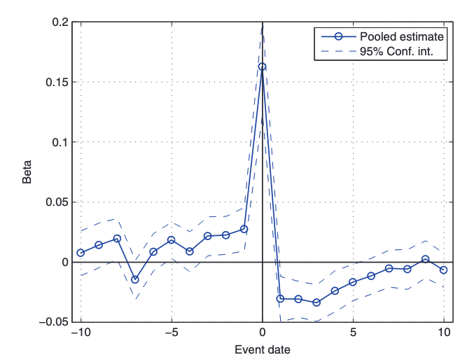{fig-align="center"}

---

### Earnings Announcements and Systematic Risk: [Savor and Wilson (2016)](https://www.jstor.org/stable/43869096) 

- Investors use announcements to revise their expectations for nonannouncing firms, but can only do so imperfectly. 
- The covariance between firm-specific and market cash flow news spikes around announcements, making announcers especially risky.
- Announcer returns forecast aggregate earnings.
- The announcement premium is persistent across stocks, and early (late) announcers earn higher (lower) returns. 

---

### Media Coverage and the Cross-Section of Returns: [Fang and Peress (2009)](https://onlinelibrary.wiley.com/doi/abs/10.1111/j.1540-6261.2009.01493.x)

**Setup:** Do stocks with less media coverage earn lower returns?

**Main finding:** Stocks with *no media coverage* earn ~3% higher annual returns than heavily covered stocks, even after controlling for size, value, momentum, and liquidity.

**Interpretation:** Consistent with Merton's (1987) investor recognition hypothesis:

- Media coverage broadens the investor base $\Rightarrow$ more risk sharing $\Rightarrow$ lower required return
- Neglected stocks must offer a premium to compensate for limited recognition

**Cross-sectional heterogeneity:** The media premium is stronger for small stocks, stocks with high individual ownership, and low analyst following — exactly where investor recognition is most binding.

BUT news coverage is exogenous in this setting. In my paper with [Jordi Mondria](https://papers.ssrn.com/sol3/papers.cfm?abstract_id=4194851) we endogenize news coverage and examine the implications for asset pricing.

---

### Social Media and Asset Pricing

**View 1: Wisdom of the crowd**

- Aggregating dispersed opinions from many investors can improve price discovery
- Social media democratizes information, allowing retail investors to surface fundamental value

**View 2: Coordination of noise traders**

- [Lopez, Martineau and Mondria (2024)](https://papers.ssrn.com/sol3/papers.cfm?abstract_id=4439793) — *Social Media and the Distortion of Price Revelation*
- Social media platforms coordinate noise traders, amplifying correlated sentiment shocks
- This *pushes prices away from fundamentals* rather than toward them
- Key mechanism: social media does not just aggregate beliefs — it *aligns* them, creating excess comovement and mispricing

**Takeaway:** Whether social media improves or distorts price revelation depends on who is paying attention and whether the signal is fundamental or noise.

